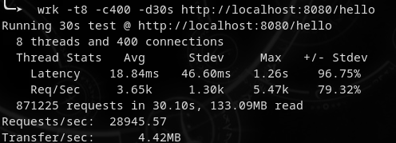
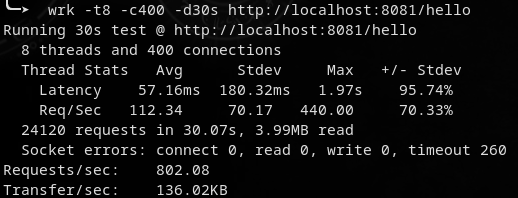
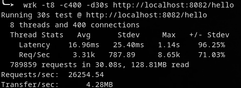
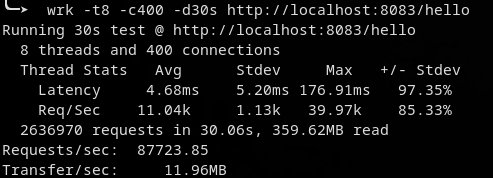
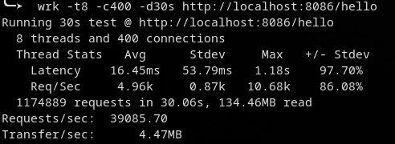
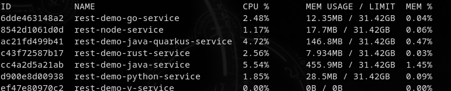

# rest-container-demo

## Introduction

A small comparison of how to implement a RESTful service using some popular/common languages and how well they can be containerized.

The services itself won't be doing anything fancy and are not much more than simple "Hello World!" projects. So this is not going to be a scientific or in depth comparison. In fact it is just a personal experiment with the nice side effect to get some starter templates for possible further projects.

## Testcase

All services implement a simple GET endpoint on path /hello that returns a JSON response:

```json
{"greeting":"Hello","name":"World"}
```
This JSON is deserialized from a simple objekt to have the mechanism of serializing/deserializing included for the comparison.

## Current services

* Java with Spring Boot
* Python with CherryPy
* Go with Gin
* Rust with actix-web
* V with builtin vweb module
* Node.js with express.js
* Java with quarkus and GraalVM


## Comparison

### Image size

Image size from small to large

| # | Service                       | Size          |
|---| ----------------------------- | ------------- |
| 1 | V with builtin vweb module    | 11,2 MB       |
| 2 | Go with Gin                   | 14,6 MB       |
| 3 | Rust with actix-web           | 17,4 MB       |
| 4 | Java with Spring Boot         | 78,2 MB       |
| 5 | Python with CherryPy          | 87,2 MB       |
| 6 | Java with quarkus/GraalVM     | 119  MB       |
| 7 | Node.js with express.js       | 185  MB       |


### podman stats


Some stats using
```
podman stats --no-stream
```

Directly after startup before making any requests:


Most notable here is the Java based service using more than two times more memory than all other services together! About 76 MB (Python + Go + Rust + V + Node + Java-Quarkus) vs 187 MB (Java-Spring). 

After some minutes and a few requests:


Sample size is a bit small but here some rankings:

By CPU usage (low to high):

| # | Service                       | CPU usage          |
|---| ----------------------------- | ------------------ |
| 1 | V with builtin vweb module    | ~< 0.1 %  |
| 1 | Go with Gin                   | ~< 0.1 %  |
| 1 | Rust with actix-web           | ~< 0.1 %  |
| 1 | Node.js with express.js       | ~< 0.1 %  |
| 1 | Java with quarkus/GraalVM     | ~< 0.1 %  |
| 6 | Python with CherryPy          | 0.85 % and 0.83 %  |
| 7 | Java with Spring Boot         | 3.08 % and 2.81 %  |

Except the Python- and the Java-Spring service all services idle below 0.1 %.
After many minutes passing the Java-Spring service settled around 1.0 %.


By MEM usage (low to high):

| # | Service                       | MEM 1     | MEM 2    |
|---| ----------------------------- | --------- | -------- |
| 1 | Rust with actix-web           | 0.51 MB   | 0.76 MB  |
| 2 | V with builtin vweb module    | 0.52 MB   | 0.95 MB  |
| 3 | Go with Gin                   | 4.85 MB   | 5.05 MB  |
| 4 | Node.js with express.js       | 15.0 MB   | 16.0 MB  |
| 5 | Java with quarkus/GraalVM     | 21.3 MB   | 24.8 MB  |
| 6 | Python with CherryPy          | 28.3 MB   | 28,3 MB  |
| 7 | Java with Spring Boot         | 187 MB   | 195 MB  |

Much more comparable than the CPU usage as the variation is higher.

### Load-testing

Using [wrk](https://github.com/wg/wrk) to benchmark the services with following command line:

```
 wrk -t8 -c400 -d30s http://localhost:<Port>/hello
```

* -t8 to use 8 threads
* -c400 use 400 connections
* -d30s run test for 30 seconds

Results:

#### Java with Spring Boot



### Python with CherryPy



### Go with Gin



### Rust with actix-web



### V with builtin vweb module

Unfortunately crashed during test.

### Node.js with express.js


### Java with quarkus and GraalVM



### Summary of load test

Ordered by request per seconds from highest to lowest

| # | Service                       | Requests/sec  | Transfer/sec  |
|---| ----------------------------- | --------- | -------- |
| 1 | Rust with actix-web           | 87723.85  | 11.96 MB |
| 2 | Java with quarkus/GraalVM     | 39085.70  | 4.47 MB  |
| 3 | Java with Spring Boot         | 28945.57  | 4.42 MB  |
| 4 | Go with Gin                   | 26254.54  | 4.28 MB  |
| 5 | Node.js with express.js       | 5189.59   | 1.34 MB  |
| 6 | Python with CherryPy          | 802.08    | 0.14 MB  |
| - | V with builtin vweb module    | crashed   | crashed  |

* The result of the Rust demo service is outstanding with more than twice the requests per seconds than the second ranked service.
* Unfortunately it was not possible to get a result for the V service as it crashes during the test. 
* Suprising result by Java with spring boot that is on the same level with Go.

Podman stats after the tests:



* Again the most notable result by Rust with the lowest memory usage.

## Some other interesting articles or benchmarks 

* https://maxday.github.io/lambda-perf/
* https://pkolaczk.github.io/memory-consumption-of-async/
